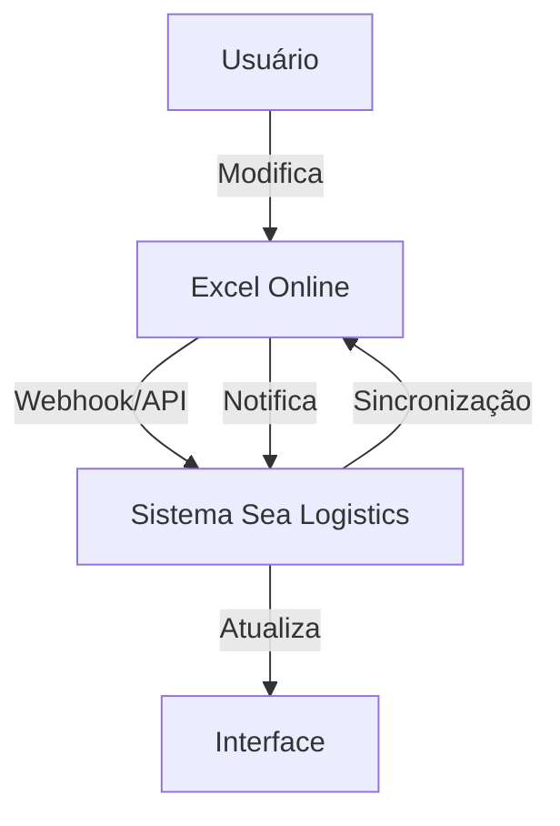

# 📊 Guia de Integração Excel Online - Microsoft Graph API

Este guia explica como configurar e usar a integração com Excel Online usando Microsoft Graph API para criar um "banco de dados vivo".

## 🚀 Funcionalidades

- ✅ **Acesso em tempo real** aos dados do Excel Online
- ✅ **Sincronização automática** entre sistema e Excel
- ✅ **Mapeamento inteligente** de campos
- ✅ **Webhook** para notificações de mudanças
- ✅ **Integração bidirecional** (enviar e receber dados)
- ✅ **Interface intuitiva** para configuração

## 📋 Pré-requisitos

1. **Conta Microsoft** (pessoal ou corporativa)
2. **Excel Online** com planilhas estruturadas
3. **Registro no Azure AD** (gratuito)

## 🔧 Configuração Passo a Passo

### 1. Registrar Aplicação no Azure AD

1. Acesse [Azure Portal](https://portal.azure.com)
2. Vá para **Azure Active Directory** > **App registrations**
3. Clique em **New registration**
4. Configure:
   - **Name**: `Sea Logistics Excel Integration`
   - **Supported account types**: `Accounts in any organizational directory and personal Microsoft accounts`
   - **Redirect URI**: `Web` - `http://localhost:3000/auth/callback` (desenvolvimento)

### 2. Configurar Permissões

1. Na aplicação criada, vá para **API permissions**
2. Clique em **Add a permission** > **Microsoft Graph** > **Delegated permissions**
3. Adicione as seguintes permissões:
   - `Files.ReadWrite` - Ler e escrever arquivos
   - `Sites.ReadWrite.All` - Acesso a sites e arquivos
   - `User.Read` - Informações básicas do usuário

### 3. Configurar Variáveis de Ambiente

Crie um arquivo `.env` na raiz do projeto:

```env
REACT_APP_AZURE_CLIENT_ID=seu_client_id_aqui
REACT_APP_AZURE_REDIRECT_URI=http://localhost:3000/auth/callback
```

### 4. Estruturar Planilha Excel

Para melhor funcionamento, organize sua planilha com:

- **Tabelas estruturadas** (não apenas células soltas)
- **Cabeçalhos claros** na primeira linha
- **Dados consistentes** em cada coluna
- **Formato de dados** apropriado (datas, números, texto)

## 🎯 Como Usar

### 1. Conectar Excel

1. Na página de envios, clique em **"Conectar Excel"**
2. Faça login com sua conta Microsoft
3. Selecione o arquivo Excel desejado
4. Escolha a planilha e tabela
5. Configure o mapeamento de campos

### 2. Sincronização Automática

- **Auto Sync**: Sincroniza a cada 30 segundos
- **Webhook**: Notificações instantâneas de mudanças
- **Manual**: Botão para sincronização sob demanda

### 3. Mapeamento de Campos

O sistema mapeia automaticamente campos com nomes similares:
- `Número do Envio` → `shipmentNumber`
- `Origem` → `origin`
- `Destino` → `destination`
- `Status` → `status`

## 🔄 Fluxo de Dados



## 🛠️ Implementação Técnica

### Serviços Principais

1. **`excelService.ts`** - Comunicação com Microsoft Graph API
2. **`excel-config.tsx`** - Interface de configuração
3. **`excel-sync.tsx`** - Controle de sincronização
4. **`excel-integration.tsx`** - Componente principal

### Endpoints Necessários (Backend)

```javascript
// Trocar código por token
POST /api/excel/token
{
  "code": "authorization_code"
}

// Webhook para mudanças
POST /api/excel/webhook
{
  "value": [...]
}
```

## 🔒 Segurança

- **Tokens OAuth2** para autenticação
- **Escopos mínimos** necessários
- **Validação de origem** nos webhooks
- **Armazenamento seguro** de tokens

## 🐛 Solução de Problemas

### Erro de Autenticação
- Verifique se o Client ID está correto
- Confirme se as permissões foram concedidas
- Teste com conta pessoal Microsoft

### Erro de Sincronização
- Verifique se a planilha tem tabelas estruturadas
- Confirme se os cabeçalhos estão na primeira linha
- Teste a conexão manualmente

### Webhook Não Funciona
- Verifique se o endpoint está acessível
- Confirme se o SSL está configurado
- Teste com ferramentas como ngrok para desenvolvimento

## 📊 Exemplo de Estrutura Excel

| Número do Envio | Origem | Destino | Status | Empresa | Data |
|----------------|--------|---------|--------|---------|------|
| SH001 | Santos | Rotterdam | Em Trânsito | ABC Corp | 2024-01-15 |
| SH002 | Hamburg | Santos | Entregue | XYZ Ltd | 2024-01-16 |

## 🚀 Próximos Passos

1. **Implementar backend** para troca de tokens
2. **Configurar webhook** endpoint
3. **Testar integração** completa
4. **Documentar casos de uso** específicos
5. **Implementar logs** de sincronização

## 📞 Suporte

Para dúvidas ou problemas:
- Consulte a [documentação Microsoft Graph](https://docs.microsoft.com/graph/)
- Verifique os logs do console do navegador
- Teste com planilhas simples primeiro

---

**Nota**: Esta integração requer configuração adequada do Azure AD e implementação do backend para produção.
